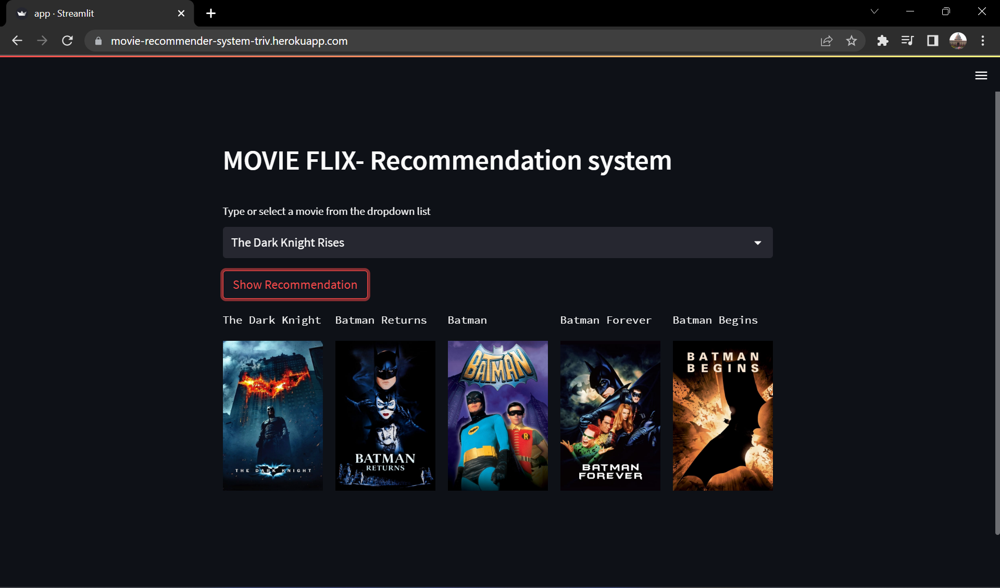

# Movie_recommender_ML
Content Based Movie Reccomendation system using Cosine similarity. App deployed on heroku . Click to open [App](https://movie-recommender-system-triv.herokuapp.com/)

Types of Recommender systems
--------------------------------
1.  Content Based (tags are created)
2.  Collaborative filtering (based on behaviour of users)
3.  Hybrid

Dataset is downloaded from [Kaggle](https://www.kaggle.com/datasets/tmdb/tmdb-movie-metadata?select=tmdb_5000_movies.csv)

To use the following code create environment in the root directory
```
conda create -p venv python==3.9 -y
```
then activate the environement
```
conda activate venv
```
install the dependencies 
```
pip install -r requirements.txt
```
To run the app of local system
```
streamlit run app.py
```
To deploy the app on heroku create setup.sh file with following code
```
mkdir -p ~/.streamlit/
echo "\
[server]\n\
headless = true\n\
port = $PORT\n\
enableCORS = false\n\
\n\
" > ~/.streamlit/config.toml
```
Also create a Procfile with following code
```
web: sh setup.sh && streamlit run app.py
```
To get the movies poster you need tmdb apikey and movie_id send get request
[READ TMDB API](https://developers.themoviedb.org/3/movies/get-movie-details)
```
https://api.themoviedb.org/3/movie/{movie_id}?api_key=<<api_key>>&language=en-US
```

